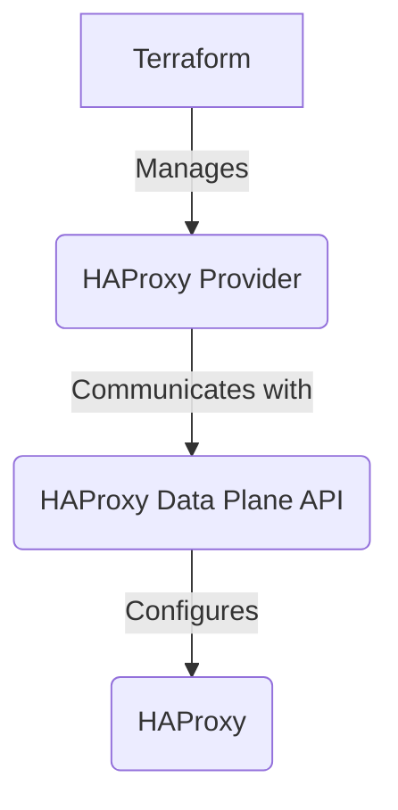

# HAProxy Terraform Provider Documentation Plan (V2)

This document outlines the plan for creating comprehensive documentation for the HAProxy Terraform provider.

## 1. High-Level Overview

This will be an introductory section in the main `README.md` that explains:

- The purpose of the provider.
- The benefits of using it to manage HAProxy with Terraform.
- The relationship between the provider and the HAProxy Data Plane API.
- A simple diagram showing the architecture: Terraform -> Provider -> Data Plane API -> HAProxy.



**Note:** The documentation will be structured to integrate seamlessly with the official [Terraform Registry](https://registry.terraform.io/), which automatically parses `*.md` files to generate documentation pages.

## 2. Provider Configuration

This section will detail how to configure the provider itself. It will cover:

- **Authentication:** How to provide the URL, username, and password for the Data Plane API.
- **Environment Variables:** Show how to use `HAPROXY_ENDPOINT`, `HAPROXY_USER`, and `HAPROXY_PASSWORD`.
- **SSL Verification:** Explain the `insecure` option for disabling SSL certificate verification.
- **Example `provider` block:**

```terraform
provider "haproxy" {
  url      = "http://haproxy.example.com:5555"
  username = "admin"
  password = "mypassword"
  insecure = true
}
```

## 3. API Transaction Handling

This section will explain how the provider interacts with the HAProxy Data Plane API's transaction-based system. It will cover:

- A brief, high-level explanation of how the API requires changes to be wrapped in a transaction.
- How the provider automates the creation, application, and deletion of transactions.
- The importance of this for ensuring atomic configuration updates.
- How this relates to potential troubleshooting scenarios (e.g., stale transaction files).

## 4. Resource Documentation

Each resource will have its own dedicated documentation page. The structure for each page will be:

- **Resource Overview:** A brief description of the HAProxy object the resource manages.
- **Example Usage:** A basic, complete example of how to use the resource.
- **Argument Reference:** A detailed list of all the arguments supported by the resource, including:
    - `(Required)` or `(Optional)` designation.
    - A clear description of what the argument does.
    - Any default values.
    - Any constraints or allowed values.
- **Nested Blocks:** Detailed documentation for any nested blocks (like `balance` or `httpchk_params`), following the same format as the top-level arguments.
- **Attribute Reference:** A list of all the attributes exported by the resource.
- **Import:** Instructions on how to import existing HAProxy resources into Terraform state.

### 4.1. `haproxy_frontend`

- Document all top-level arguments (`name`, `default_backend`, `mode`, etc.).
- Document the `monitor_fail` nested block.
- Document the `acl`, `httprequestrule`, and `httpresponserule` nested blocks, explaining how they are used to build complex frontend logic.

### 4.2. `haproxy_backend`

- Document all top-level arguments (`name`, `mode`, `adv_check`, etc.).
- Document the `balance`, `httpchk_params`, and `forwardfor` nested blocks.
- Document the `httpcheck` nested block and how it relates to the top-level `adv_check`.

### 4.3. `haproxy_server`

- Document all top-level arguments (`name`, `address`, `port`, `parent_name`, `parent_type`, etc.).
- Explain the relationship between a server and its parent backend.
- Detail all health check parameters (`check`, `inter`, `rise`, `fall`).
- Document all SSL-related parameters.

### 4.4. `haproxy_bind`

- Document all top-level arguments (`name`, `address`, `port`, `parent_name`, `parent_type`, etc.).
- Explain the relationship between a bind and its parent frontend.
- Detail all SSL-related parameters.

## 5. Data Source Documentation

This section will document all available data sources. While none are currently implemented, this section will serve as a placeholder for future additions. The structure for each data source page will be:

- **Data Source Overview:** A brief description of the information the data source provides.
- **Example Usage:** A basic example of how to use the data source.
- **Argument Reference:** A list of arguments to filter or specify the data to be fetched.
- **Attribute Reference:** A list of all the attributes exported by the data source.

## 6. Common Services

This section will provide more in-depth explanations of the common services that can be configured within other resources. This will help users understand how to use these powerful features effectively.

- **ACLs:** How to define and use ACLs for conditional logic.
- **HTTP Request/Response Rules:** How to manipulate HTTP traffic with rules.
- **Health Checks:** A deeper dive into the different types of health checks available.

## 7. Comprehensive Usage Examples

This section will provide complete, real-world examples that demonstrate how to combine multiple resources to build a functional HAProxy configuration. Examples will include:

- **Basic HTTP Load Balancer:** A simple frontend and backend with two servers.
- **HTTPS Load Balancer:** An example showing how to configure SSL termination.
- **Path-Based Routing:** An example using ACLs and HTTP request rules to route traffic based on the URL path.
- **Blue/Green Deployments:** A more advanced example showing how to manage two backends for blue/green deployments.

## 8. Contributing Guide

To encourage community contributions, a `CONTRIBUTING.md` file will be created with:

- Instructions on how to set up the development environment.
- The process for submitting bug reports and feature requests.
- Coding standards and best practices.
- How to run the test suite.

## 9. Changelog and Versioning

A `CHANGELOG.md` file will be maintained to track all changes to the provider. It will follow the [Keep a Changelog](https://keepachangelog.com/en/1.0.0/) format and will include sections for:

- `Added` for new features.
- `Changed` for changes in existing functionality.
- `Deprecated` for soon-to-be-removed features.
- `Removed` for now-removed features.
- `Fixed` for any bug fixes.
- `Security` in case of vulnerabilities.

## 10. Troubleshooting Section

A section in the main documentation dedicated to common issues and their solutions, such as:

- "404 Not Found" errors when communicating with the Data Plane API.
- Authentication failures.
- Issues with transaction versions.
- Common configuration errors and how to resolve them.