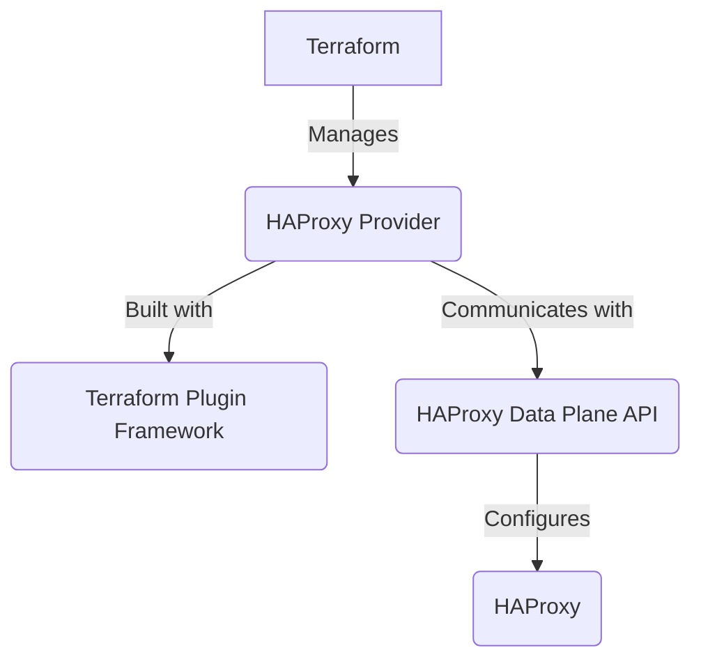
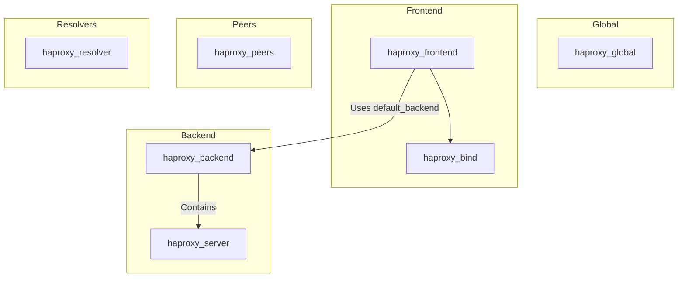

# HAProxy Terraform Provider Documentation Plan (V5)

This document outlines the plan for creating comprehensive documentation for the HAProxy Terraform provider. This version details the migration to the **Terraform Plugin Framework**, which provides enhanced support for nested resources and more granular control over configuration updates.

## 1. High-Level Overview

This will be an introductory section in the main `README.md` that explains:

- The purpose of the provider.
- The benefits of using it to manage HAProxy with Terraform.
- The migration to the Terraform Plugin Framework and its advantages.
- The relationship between the provider and the HAProxy Data Plane API.
- A simple diagram showing the architecture: Terraform -> Provider -> Data Plane API -> HAProxy.



**Note:** The documentation will be structured to integrate seamlessly with the official [Terraform Registry](https://registry.terraform.io/). It will also serve as a companion to the official [HAProxy Data Plane API Documentation](https://www.haproxy.com/documentation/dataplaneapi/), which is the source of truth for all API interactions.

## 2. Terraform Plugin Framework Migration

This new section will be dedicated to explaining the move from the legacy SDKv2 to the modern Terraform Plugin Framework.

- **Key Benefits:**
    - **Improved Nested Block Handling:** Explain how the framework's support for complex types and nested attributes allows for more efficient and accurate updates. For example, with ACLs, you can add, remove, or modify a single ACL rule within a frontend or backend without forcing a replacement of the entire list of ACLs. This makes configurations more robust and operations much faster.
    - **Clearer Schema Definition:** How the framework provides a more robust and expressive way to define resource schemas.
    - **Enhanced Error Reporting:** Better diagnostics and more precise error messages.
- **Impact on Users:**
    - Explain any breaking changes for users migrating from older versions of the provider.
    - Provide a clear migration guide with side-by-side examples.

## 3. Provider Configuration

This section will detail how to configure the provider itself. It will cover:

- **Authentication:** How to provide the URL, username, and password for the Data Plane API.
- **Environment Variables:** Show how to use `HAPROXY_ENDPOINT`, `HAPROXY_USER`, and `HAPROXY_PASSWORD`.
- **SSL Verification:** Explain the `insecure` option for disabling SSL certificate verification.
- **API Versioning:** A new field to allow users to specify the Data Plane API version (`v2` or `v3`).

- **Example `provider` block:**

```terraform
provider "haproxy" {
  url          = "http://haproxy.example.com:5555"
  username     = "admin"
  password     = "mypassword"
  insecure     = true
  api_version  = "v3" 
}
```

## 4. API Versioning and Compatibility

This new section will explain how the provider handles different versions of the HAProxy Data Plane API.

- **Supported Versions:** Clearly state that the provider supports both `v2` and `v3` of the Data Plane API.
- **Feature Parity:** Explain that some resources or arguments may only be available in `v3`.
- **Provider Behavior:** Describe how the provider adapts its behavior based on the selected `api_version`.
- **Migration Guide:** Provide guidance for users who want to migrate their configurations from `v2` to `v3`.

## 5. API Transaction Handling

This section will explain how the provider interacts with the HAProxy Data Plane API's transaction-based system. It will cover:

- A brief, high-level explanation of how the API requires changes to be wrapped in a transaction.
- How the provider automates the creation, application, and deletion of transactions.
- The importance of this for ensuring atomic configuration updates.

## 6. Resource Relationships

This section will clarify the hierarchy and dependencies between the main resources.



## 7. Resource Documentation

Each resource will have its own dedicated documentation page. The structure for each page will be updated to reflect the Plugin Framework's schema.

- **Resource Overview:** A brief description of the HAProxy object the resource manages.
- **Data Plane API Endpoint:** The corresponding Data Plane API endpoint (e.g., `/v2/services/haproxy/configuration/frontends`).
- **Example Usage:** A basic, complete example.
- **Schema Reference:** A detailed list of all arguments and attributes, noting which are computed, optional, or required. This replaces the separate "Argument Reference" and "Attribute Reference" sections.
- **Import:** Instructions on how to import existing resources.

### 7.1. Core Resources
- `haproxy_global`
- `haproxy_frontend`
- `haproxy_backend`
- `haproxy_server`
- `haproxy_bind`

### 7.2. Service Discovery
- `haproxy_resolver`
- `haproxy_nameserver`

### 7.3. High Availability & Stickiness
- `haproxy_peers`
- `haproxy_peer_entry`
- `haproxy_stick_rule`
- `haproxy_stick_table`

### 7.4. Rules and Checks
- `haproxy_acl`
- `haproxy_tcp_check`
- `haproxy_http_check`
- `haproxy_http_request_rule`
- `haproxy_http_response_rule`
- `haproxy_tcp_request_rule`
- `haproxy_tcp_response_rule`

### 7.5. Logging
- `haproxy_log_forward`

## 8. Data Source Documentation

This section will document all available data sources.

### 8.1. `haproxy_backends`
- **Overview:** Fetches a list of all configured HAProxy backends.
- **Example Usage:**
  ```terraform
  data "haproxy_backends" "all" {}

  output "backend_names" {
    value = data.haproxy_backends.all.names
  }
  ```
- **Argument Reference:** None.
- **Attribute Reference:** `names` (a list of all backend names).

### 8.2. `haproxy_frontends`
- **Overview:** Fetches a list of all configured HAProxy frontends.
- **Example Usage:**
  ```terraform
  data "haproxy_frontends" "all" {}

  output "frontend_names" {
    value = data.haproxy_frontends.all.names
  }
  ```
- **Argument Reference:** None.
- **Attribute Reference:** `names` (a list of all frontend names).

## 9. Comprehensive Usage Examples

This section will provide complete, real-world examples that demonstrate how to combine multiple resources to build a functional HAProxy configuration. Examples will include:

- **Basic HTTP/HTTPS Load Balancer**
- **Path-Based Routing with ACLs**
- **Blue/Green Deployments**
- **DNS-Based Service Discovery with Resolvers**
- **Session Persistence with Stick Tables**
- **Granular Updates with Nested Blocks:** A new example showing how to modify a single item in a list (like a server in a backend) without affecting other items in the list.

## 10. Contributing Guide

To encourage community contributions, a `CONTRIBUTING.md` file will be created with:

- Instructions on how to set up the development environment.
- The process for submitting bug reports and feature requests.
- Coding standards and best practices.
- How to run the test suite.

## 11. Changelog and Versioning

A `CHANGELOG.md` file will be maintained to track all changes to the provider. It will follow the [Keep a Changelog](https://keepachangelog.com/en/1.0.0/) format and will include sections for:

- `Added` for new features.
- `Changed` for changes in existing functionality.
- `Deprecated` for soon-to-be-removed features.
- `Removed` for now-removed features.
- `Fixed` for any bug fixes.
- `Security` in case of vulnerabilities.

## 12. Troubleshooting Section

A section in the main documentation dedicated to common issues and their solutions, such as:

- "404 Not Found" errors when communicating with the Data Plane API.
- Authentication failures.
- Issues with transaction versions.
- Common configuration errors and how to resolve them.